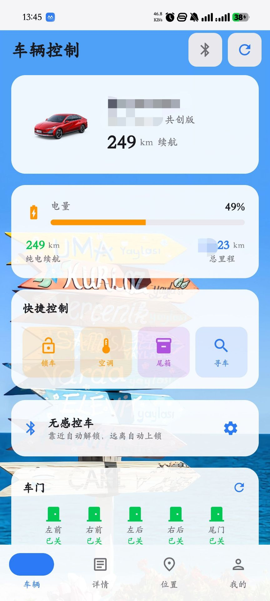
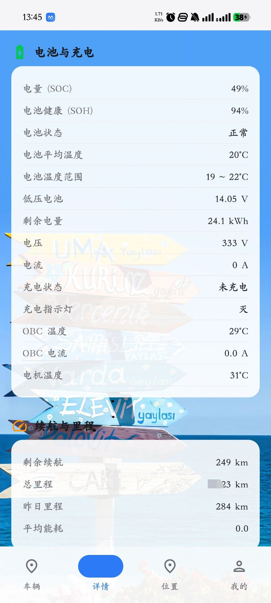
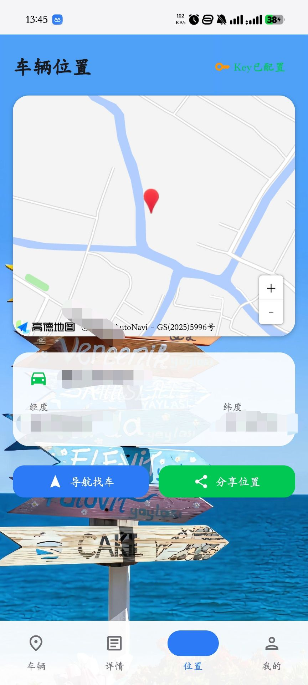
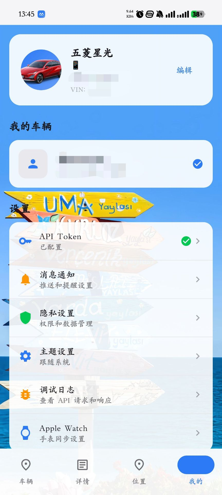

五菱汽车车控 APP
 
本项目是基于 https://github.com/hasscc/wuling  开发的五菱新能源独立开源车控APP，无需Home Assistant环境，直接对接五菱官方车联网接口，为五菱新能源车主提供一站式、全维度的车辆控制与状态监控体验。
本项目由https://gitee.com/wlsqqq/wuling-automotive-control首发，本人将其转移到github上，如有侵权，会第一时间删除。
 
 
 
✨ 核心功能
 
- 🔧 远程车辆控制：支持一键解锁/上锁、远程开启空调、开启尾箱、寻车鸣笛等快捷操作，随时随地掌控车辆
- 📊 全维度状态监控：实时查看车辆电量(SOC)、电池健康(SOH)、剩余续航、总里程、昨日里程、平均能耗、电池温度、电机温度、低压电池状态等核心数据，全方位掌握车辆健康
- 🗺️ 车辆位置服务：集成高德地图，实时获取车辆精准定位，支持一键导航找车、位置分享，轻松找车、协同用车
- ⚙️ 个性化配置：支持API Token快速绑定、消息通知自定义、主题设置、调试日志查看、Apple Watch同步等功能，适配个性化使用习惯
 
 
 

🚗 适配车型
 
- 核心适配：五菱星光（含共创版等全系车型）
- 兼容支持：五菱新能源全系车型（基于五菱通用车联网接口，可自行测试适配）
 
 
 
📦 安装与使用
 
1. 从项目Release页面下载安装包（Android）
2. 安装完成后，按照指引配置API Token，完成车辆绑定
3. API Token自行获取
4. 绑定成功后，即可使用全部车控与监控功能
5. 建议用授权的手机号获取token
6. 蓝牙功能暂不可用
 
 
⚠️ 重要声明
 
1. 本项目为非官方第三方开源工具，仅用于个人学习与研究，禁止用于任何商业用途
2. 本项目所有数据均直接与五菱官方车联网接口交互，不存储用户账号、车辆等任何敏感信息，使用过程中的所有风险由用户自行承担
3. 「五菱」「五菱星光」为五菱汽车官方注册商标，本项目仅为工具类应用，与五菱汽车官方无任何隶属或合作关系
 
 
 
🤝 参与贡献
 
欢迎提交Issue反馈使用问题、提出功能优化建议，也欢迎提交PR共同完善项目、适配更多车型、优化用户体验。
 
 
 
📄 开源协议
 
本项目基于 MIT License 开源，遵循原项目开源协议，完全免费开源，仅供个人学习与非商业使用。